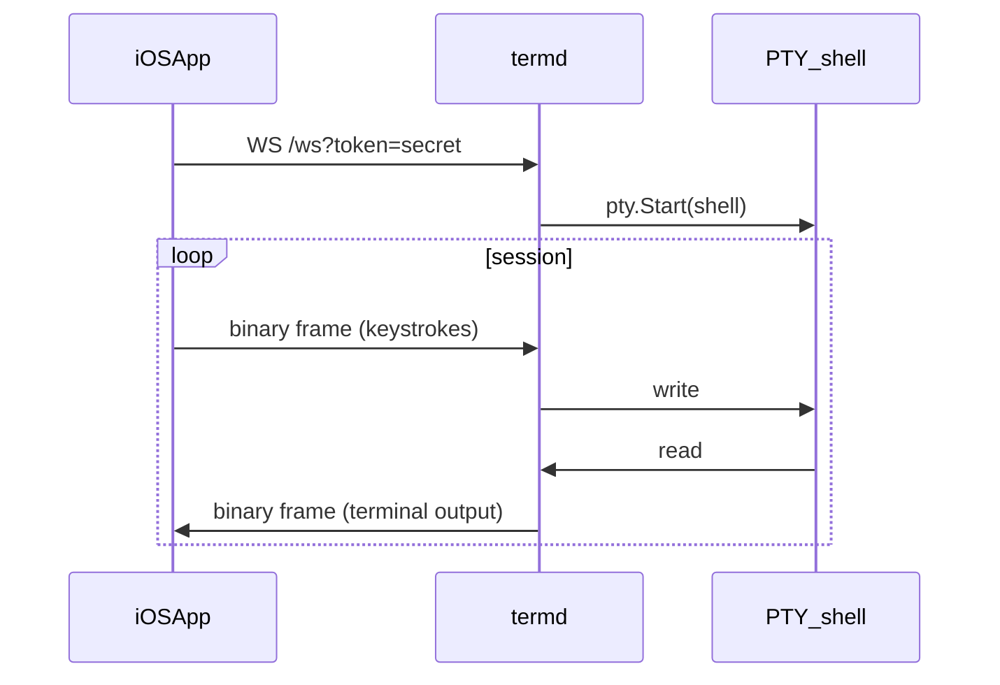

# IntegratedDevEnv

A deliberately polyglot “IDE shell” for iOS: a **scratch editor**, a **remote terminal** (SwiftTerm) backed by a **Go** WebSocket + PTY server (`termd`), plus a tiny **Python** CI manifest generator. CI fans out across many jobs (lint, tests, Docker, unsigned iOS archive).

## Architecture

- **iOS (Swift / SwiftUI):** `Editor` tab (plain text), `Terminal` tab (SwiftTerm `TerminalView` + `URLSessionWebSocketTask`). Settings store **WebSocket URL** and **token** in `UserDefaults`.
- **termd (Go):** `GET /health`, WebSocket `GET /ws?token=…`. After a successful upgrade, the server runs `/bin/sh` (override with `TERMD_SHELL`) on a PTY and bridges **binary WebSocket frames** to the PTY (and back). **Not safe on the public internet** without a VPN or reverse proxy; use a strong `TERMD_TOKEN`.
- **Python:** `tools/generate_report.py` writes `manifest.json` for CI artifacts.



## Wire protocol

- **WebSocket path:** `/ws`
- **Auth:** query parameter `token` must equal `TERMD_TOKEN`.
- **Frames:** **binary** (preferred) or text; payload bytes are forwarded to/from the shell as-is.

## Environment variables (termd)

| Variable | Meaning | Default |
|----------|---------|---------|
| `TERMD_ADDR` | HTTP listen address | `:8080` |
| `TERMD_TOKEN` | Shared secret (required) | _none_ |
| `TERMD_SHELL` | Shell to run under PTY | `/bin/sh` |
| `TERMD_MAX_SESSIONS` | Reserved for future limiting | `16` |

## Running termd

**Linux / macOS (native):**

```bash
cd server
export TERMD_TOKEN='change-me'
go run ./cmd/termd
```

**Docker (from repo root):**

```bash
docker build -f docker/Dockerfile -t termd:local .
docker run --rm -e TERMD_TOKEN=change-me -p 8080:8080 termd:local
```

**Windows:** run the server **inside Docker or WSL**; PTY bridging is Unix-oriented. The HTTP handler rejects WebSocket upgrades on native Windows with a clear error.

## iOS app: generate Xcode project

```bash
brew install xcodegen
cd ios
xcodegen generate
open IntegratedDevEnv.xcodeproj
```

**App Transport Security:** `Info.plist` sets `NSAllowsArbitraryLoads` for development (plain `ws://`). For anything beyond a lab network, terminate TLS at a reverse proxy and use `wss://`.

## Unsigned / sideload distribution

CI builds an **unsigned** device archive and zips it as `IntegratedDevEnv-unsigned.ipa` (no App Store signing). To install on a device you still use a **development/ad hoc** flow, for example:

- **Xcode:** open the generated project, select your device, sign with your **Apple Development** team, Run.
- **AltStore / Sideloadly / similar:** follow that tool’s flow for sideloading an `.ipa` exported with your signing assets.

The artifact produced in GitHub Actions is meant for **CI verification**; expect to re-sign locally for installation.

## Security warnings

- `TERMD_TOKEN` is a single shared secret; anyone on the network who can reach `termd` and guess or learn the token gets a shell **as the server user** (in Docker, typically `termd`).
- Do **not** expose `termd` directly to the internet. Put it behind a VPN, SSH tunnel, or authenticated reverse proxy.
- `CheckOrigin` currently allows all WebSocket origins; tighten when you know your app’s origin.

## GitHub Actions

Workflow: [.github/workflows/ci.yml](.github/workflows/ci.yml). Jobs include Python manifest generation, `go vet` + `staticcheck`, `go test` on Go 1.22 and 1.23, Docker image build, XcodeGen + unsigned `.ipa` packaging. This is intentionally verbose; it is **not** meant to stress GitHub’s service limits—keep concurrency reasonable.

## Repository layout

- [ios/](ios/) — SwiftUI app + XcodeGen `project.yml`
- [server/](server/) — Go `termd`
- [docker/](docker/) — production-style image
- [tools/](tools/) — Python CI helper
